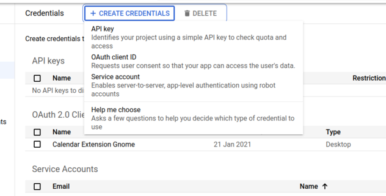
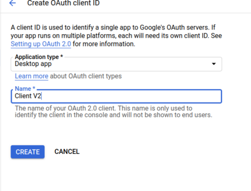
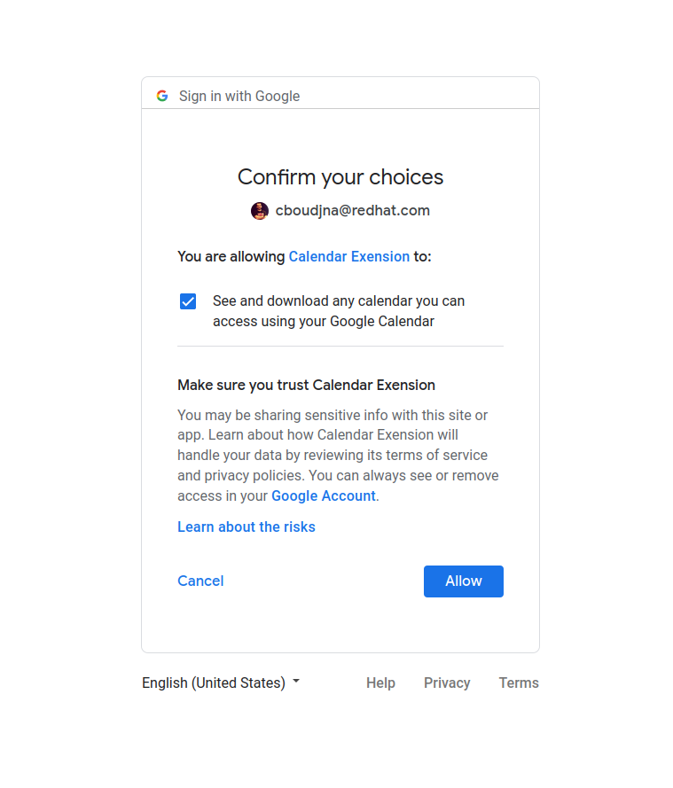

# Gnome Next Meeting applet

An applet to show your next meetings in Gnome

* Free software: GNU General Public License v3

## Screenshot


## Installation

### Ubuntu
```
apt install python3-tzlocal python3-dateutil python3-googleapi python3-httplib2 python3-oauth2client python3-gi python3-yaml
pip3 install --user git+https://github.com/chmouel/gnome-next-meeting-applet
```

## Features

* Make it easy to know how long you have until your next meeting.
* Detect video conference URL in location or google meet.
* Shows the documents link to the current meeting.
* Fully configurable.

## Configuration

### Applet configuration

The applet can be configured with a config.yaml yaml located in your
`$HOME/.config/gnome-next-meeting-applet/config.yaml`. This gets generated
automatically when launching `gnome-next-meeting-applet-auth`.

A configured example is located in the [config.samples.yaml](./config.samples.yaml).

* **default_icon**: The default icon when showing each meeting.
* **event_organizers_icon**: A map between a regexp matching the organizer to an
  icon. This allows you to easily differentiate certain type of meetings like
  the one from your team or colleagues.
* **max_results**: Max results to ask to google calendar api.
* **skip_non_accepted**: Skip the calendar events that you didn't accept, you
  need to configure `my_email` setting for that.
* **my_email**: Your email address
* **restrict_to_calendar**: Restrict to some calendar, by default it shows event from all calendars.
* **title_max_char**: The maximum length of the title

### Oauth token configuration

Before launching the applet you need to first generate a Google OAuth 2.0 Client
Credentials and authorize it.

* Go to the Google Cloud Console: https://console.developers.google.com/apis/credentials

* Select Create credentials and Oauth Client ID



* Select "Desktop app" for the Application Type and give it a name.



* On the next screen you can just click OK, since we will look over the auth json file.

* Now next to your created application you will see an icon to download the auth
 json file, click on it and store it somewhere in a name you can rememeber (ie: `client_secret.json`)


* In the terminal launch `gnome-next-meeting-applet-auth` with the path to the auth json file : 

   `gnome-next-meeting-applet-auth ~/Downloads/client_secret.json`

* This will launch your webbrowser to do the oauth dance

* If your browser tells you the apps is unverified you can say it's okay (it's
 should be the one that you have created yourself).

* After the last click of authorizations the credentials has been created.



* You can now launch the gnome-next-meeting applet.

### Starting

You can just do : 

Alt+F2 and start `gnome-next-meeting-applet` make sure you have done the oauth
dance previously.

There is a setting menu to add an autostart file to autostart it when gnome
launch.

### Credits

* This package was created with
[Cookiecutter](https://github.com/audreyr/cookiecutter-pypackage) and the
`[audreyr/cookiecutter-pypackage](https://github.com/audreyr/cookiecutter-pypackage)`
project template.
* Originally inspired from the [gnome next
  meeting](https://github.com/tjwells47/gnome-next-meeting) argos based
  extension.
* Used for a while the OSX Version
  https://apps.apple.com/us/app/next-meeting/id1017470484?mt=12 and missed it on
  Linux.
